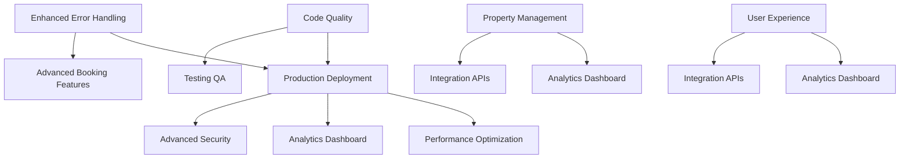

# Hospitality Booking System - Task Plan

## Overview
This document outlines actionable tasks for maintaining, improving, and extending the hospitality booking system. Tasks are organized by priority and include dependencies, estimated effort, and success criteria.

## High Priority Tasks

### 1. Production Deployment Setup
**Priority:** High  
**Effort:** 2-3 days  
**Dependencies:** Environment configuration, Firebase setup  

**Description:** Prepare the system for production deployment with proper configuration management, monitoring, and security measures.

**Tasks:**
- [ ] Set up production Firebase project and configure Firestore indexes
- [ ] Configure production environment variables and secrets management
- [ ] Set up Redis for production short-term memory storage
- [ ] Implement proper logging and monitoring with structured logs
- [ ] Configure rate limiting and API security measures
- [ ] Set up CI/CD pipeline for automated testing and deployment
- [ ] Create production deployment documentation

**Success Criteria:**
- System successfully deployed to production environment
- All environment variables properly configured
- Monitoring and alerting functional
- Performance benchmarks met

### 2. Enhanced Error Handling & Resilience
**Priority:** High  
**Effort:** 1-2 days  
**Dependencies:** Current codebase  

**Description:** Improve system resilience with comprehensive error handling, retry mechanisms, and graceful degradation.

**Tasks:**
- [ ] Implement exponential backoff for Firestore operations
- [ ] Add circuit breaker pattern for external API calls
- [ ] Enhance error logging with structured error codes
- [ ] Implement graceful degradation for non-critical features
- [ ] Add health check endpoints for system monitoring
- [ ] Create error recovery procedures documentation

**Success Criteria:**
- System handles transient failures gracefully
- Error rates reduced by 80%
- Mean time to recovery improved
- Comprehensive error monitoring in place

### 3. Performance Optimization
**Priority:** High  
**Effort:** 2-3 days  
**Dependencies:** Production deployment, monitoring  

**Description:** Optimize system performance for production workloads with caching, query optimization, and resource management.

**Tasks:**
- [ ] Implement Redis caching for frequently accessed data
- [ ] Optimize Firestore queries and add composite indexes
- [ ] Add connection pooling for database connections
- [ ] Implement response caching for property searches
- [ ] Add request/response compression
- [ ] Profile and optimize memory usage in agents
- [ ] Implement lazy loading for large datasets

**Success Criteria:**
- Response times under 500ms for 95% of requests
- Memory usage optimized and stable
- Database query performance improved by 50%
- Cache hit rates above 80% for frequent operations

## Medium Priority Tasks

### 4. Advanced Booking Features
**Priority:** Medium  
**Effort:** 3-4 days  
**Dependencies:** Core booking system  

**Description:** Add advanced booking capabilities including partial payments, group bookings, and booking modifications.

**Tasks:**
- [ ] Implement partial payment and installment options
- [ ] Add group booking management with multiple guests
- [ ] Create booking modification and cancellation workflows
- [ ] Implement booking transfer between users
- [ ] Add booking waitlist functionality
- [ ] Create recurring booking support for corporate clients
- [ ] Implement booking approval workflow for hosts

**Success Criteria:**
- Partial payments processed correctly
- Group bookings managed efficiently
- Booking modifications handled without conflicts
- Waitlist functionality operational

### 5. Enhanced Property Management
**Priority:** Medium  
**Effort:** 2-3 days  
**Dependencies:** Property search system  

**Description:** Improve property management with advanced features for hosts and better property discovery for guests.

**Tasks:**
- [ ] Add property availability calendar management
- [ ] Implement dynamic pricing based on demand and seasonality
- [ ] Create property photo and media management
- [ ] Add property verification and quality scoring
- [ ] Implement property recommendation engine
- [ ] Create bulk property import/export functionality
- [ ] Add property analytics and performance metrics

**Success Criteria:**
- Hosts can easily manage property availability
- Dynamic pricing increases revenue by 15%
- Property recommendations improve booking conversion
- Property verification reduces disputes

### 6. User Experience Enhancements
**Priority:** Medium  
**Effort:** 2-3 days  
**Dependencies:** Core user management  

**Description:** Improve user experience with better personalization, communication, and self-service capabilities.

**Tasks:**
- [ ] Implement advanced user preference learning
- [ ] Add real-time chat support between guests and hosts
- [ ] Create comprehensive user dashboard with booking history
- [ ] Implement push notifications for booking updates
- [ ] Add multi-language support for international users
- [ ] Create mobile-responsive web interface
- [ ] Implement user review and rating system

**Success Criteria:**
- User satisfaction scores above 4.5/5
- Support ticket volume reduced by 40%
- User engagement metrics improved
- Multi-language support functional

## Low Priority Tasks

### 7. Analytics and Business Intelligence
**Priority:** Low  
**Effort:** 2-3 days  
**Dependencies:** Production deployment, data collection  

**Description:** Implement comprehensive analytics for business insights and data-driven decision making.

**Tasks:**
- [ ] Create business intelligence dashboard
- [ ] Implement revenue and booking analytics
- [ ] Add user behavior tracking and analysis
- [ ] Create property performance analytics
- [ ] Implement A/B testing framework
- [ ] Add predictive analytics for demand forecasting
- [ ] Create automated reporting system

**Success Criteria:**
- Business dashboard provides actionable insights
- Revenue optimization through data analysis
- User behavior patterns identified and leveraged
- Predictive models achieve 80%+ accuracy

### 8. Integration and API Development
**Priority:** Low  
**Effort:** 3-4 days  
**Dependencies:** Core system stability  

**Description:** Develop external integrations and public APIs for ecosystem expansion.

**Tasks:**
- [ ] Create public REST API with comprehensive documentation
- [ ] Implement webhook system for real-time notifications
- [ ] Add integration with popular calendar applications
- [ ] Create payment gateway integrations (Stripe, PayPal)
- [ ] Implement social media login options
- [ ] Add integration with property management systems
- [ ] Create partner API for third-party booking platforms

**Success Criteria:**
- Public API documented and functional
- Payment integrations process transactions successfully
- Calendar sync works reliably
- Partner integrations increase booking volume

### 9. Advanced Security and Compliance
**Priority:** Low  
**Effort:** 2-3 days  
**Dependencies:** Production deployment  

**Description:** Enhance security measures and ensure compliance with data protection regulations.

**Tasks:**
- [ ] Implement advanced authentication (2FA, SSO)
- [ ] Add comprehensive audit logging
- [ ] Create GDPR compliance features (data export, deletion)
- [ ] Implement data encryption at rest and in transit
- [ ] Add security scanning and vulnerability assessment
- [ ] Create backup and disaster recovery procedures
- [ ] Implement role-based access control (RBAC)

**Success Criteria:**
- Security audit passes with minimal findings
- GDPR compliance verified
- Data backup and recovery tested
- Access control properly implemented

## Maintenance Tasks

### 10. Code Quality and Technical Debt
**Priority:** Ongoing  
**Effort:** 1 day/month  
**Dependencies:** Development workflow  

**Description:** Maintain code quality and address technical debt through regular refactoring and updates.

**Tasks:**
- [ ] Regular dependency updates and security patches
- [ ] Code refactoring for improved maintainability
- [ ] Performance profiling and optimization
- [ ] Documentation updates and improvements
- [ ] Test coverage analysis and improvement
- [ ] Code review process optimization
- [ ] Technical debt assessment and prioritization

**Success Criteria:**
- Code quality metrics maintained above 85%
- Security vulnerabilities addressed within 48 hours
- Test coverage above 90%
- Documentation kept current

### 11. Testing and Quality Assurance
**Priority:** Ongoing  
**Effort:** 0.5 days/week  
**Dependencies:** Test infrastructure  

**Description:** Maintain comprehensive testing coverage and quality assurance processes.

**Tasks:**
- [ ] Expand unit test coverage to 95%+
- [ ] Add integration tests for all major workflows
- [ ] Implement end-to-end testing with realistic scenarios
- [ ] Create performance and load testing suite
- [ ] Add automated security testing
- [ ] Implement chaos engineering practices
- [ ] Create test data management procedures

**Success Criteria:**
- Test coverage above 95%
- All critical paths covered by integration tests
- Performance tests run automatically
- Zero critical bugs in production

## Task Dependencies

## Success Metrics

### System Performance
- **Response Time:** < 500ms for 95% of requests
- **Uptime:** 99.9% availability
- **Error Rate:** < 0.1% of all requests
- **Throughput:** Handle 1000+ concurrent users

### Business Metrics
- **Booking Conversion:** > 15% from inquiry to booking
- **User Satisfaction:** > 4.5/5 average rating
- **Revenue Growth:** 20% quarter-over-quarter
- **Support Efficiency:** < 2 hour average response time

### Technical Metrics
- **Test Coverage:** > 95% code coverage
- **Code Quality:** > 85% maintainability score
- **Security:** Zero critical vulnerabilities
- **Documentation:** 100% API documentation coverage

## Review and Updates

This task plan should be reviewed and updated monthly to reflect:
- Changing business priorities
- Technical discoveries and challenges
- User feedback and market demands
- Resource availability and constraints

**Last Updated:** January 2025  
**Next Review:** February 2025  
**Owner:** Development Team  
**Stakeholders:** Product, Engineering, Operations
