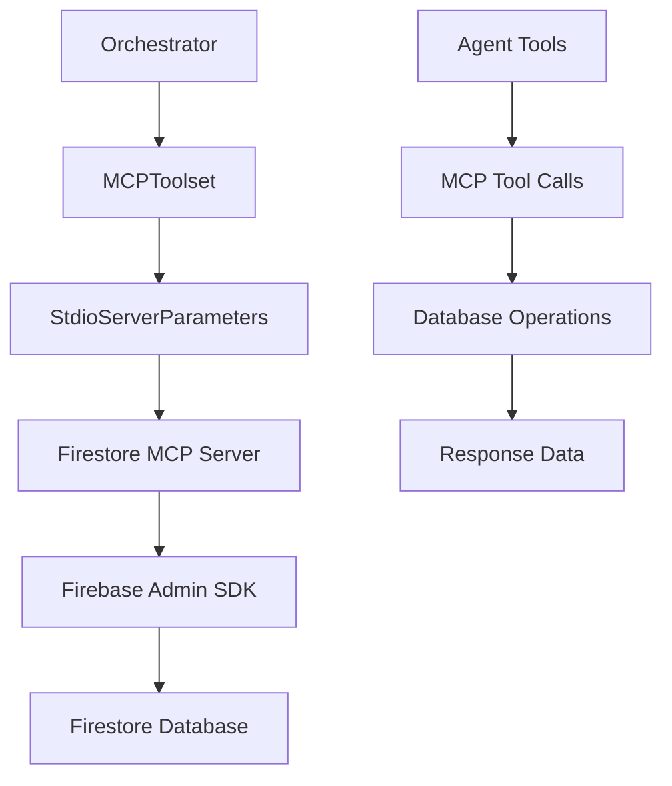

# MCP Servers Directory Management

## Purpose & Responsibilities

The `mcp_servers/` directory implements **Model Context Protocol (MCP) servers** that provide external tool integration for the hospitality booking system. The primary server is the **Firestore MCP server** which handles all database operations, with additional servers for monitoring and notifications.

## Directory Structure

```
mcp_servers/
├── firestore/               # Primary database MCP server
│   ├── __init__.py         # Package initialization
│   ├── server.py           # Main MCP server implementation
│   ├── models.py           # Pydantic data models
│   └── transactions.py     # Transaction logic & overlap detection
├── monitoring/             # Metrics & monitoring MCP server
└── notify/                 # Notification services MCP server
```

## Core Components

### Firestore MCP Server (`firestore/`)

**Purpose**: Provides database operations as MCP tools for agents

**Key Features**:
- **CRUD Operations**: Complete Create, Read, Update, Delete for all entities
- **Transaction Support**: Atomic operations with overlap detection
- **Idempotency**: Natural key generation prevents duplicate bookings
- **Data Models**: Pydantic models for type safety and validation
- **Connection Management**: Firebase Admin SDK integration

#### Server Implementation (`server.py`)

**MCP Tools Provided**:
```python
# User Management
- create_user(name, email, role, phone, preferences)
- get_user(user_id=None, email=None)

# Property Management  
- create_property(user_id, name, description, city, country, ...)
- search_properties(city, check_in_date, check_out_date, ...)

# Booking Management
- create_booking(property_id, guest_id, host_id, dates, ...)
- get_booking(booking_id)
- update_booking_status_tool(booking_id, new_status, reason)
- get_user_bookings(user_id, role, status)
```

**Connection Setup**:
```python
# Firebase initialization
cred = credentials.Certificate(cred_path)
firebase_admin.initialize_app(cred)
db = firestore.client()

# MCP server registration
server = Server()
for tool in tools:
    mcp_tool = adk_to_mcp_tool_type(tool)
    server.register_tool(mcp_tool)
```

#### Data Models (`models.py`)

**Core Entities**:
```python
class User(BaseModel):
    uid: str
    name: str
    email: str  # unique constraint
    role: UserRole  # guest/host/admin
    phone: Optional[str]
    preferences: Dict[str, Any]
    created_at: datetime

class Property(BaseModel):
    property_id: str
    user_id: str  # host
    name: str
    location: Location
    minimum_price: float
    guest_space: int
    amenities: List[str]
    status: PropertyStatus  # active/inactive/maintenance

class Booking(BaseModel):
    booking_id: str
    property_id: str
    guest_id: str
    host_id: str
    check_in_date: datetime
    check_out_date: datetime
    status: BookingStatus  # pending/confirmed/cancelled/completed
    total_price: float
```

#### Transaction Logic (`transactions.py`)

**Idempotent Booking Creation**:
```python
def generate_natural_key(guest_id, property_id, check_in, check_out):
    # Creates deterministic SHA256 hash
    # Prevents duplicate bookings for same parameters

def check_booking_overlap(db, property_id, check_in, check_out):
    # Queries existing bookings for date conflicts
    # Returns True if overlap exists

def create_booking_transaction(transaction, db, booking_data):
    # Atomic booking creation with overlap checking
    # Uses Firestore transactions for consistency
```

## MCP Integration Architecture

### Connection Flow



### Tool Registration Process

```python
# In orchestrator/main.py
firestore_mcp = MCPToolset(
    connection_params=StdioServerParameters(
        command="python",
        args=[str(firestore_server_path)]
    )
)

# Tools become available to agents
root_agent = LlmAgent(
    tools=[firestore_mcp] if firestore_mcp else []
)
```

## How to Use & Extend

### Using Firestore MCP Tools

**In Agent Tools**:
```python
# Tools are automatically available to agents via orchestrator
# Example: BookingAgent using create_booking tool

async def process_booking(...):
    # This will call the MCP server's create_booking function
    result = await create_booking(
        property_id=property_id,
        guest_id=guest_id,
        # ... other parameters
    )
    return result
```

**Direct MCP Server Testing**:
```bash
# Run server standalone
python mcp_servers/firestore/server.py

# Test connection
python test_firestore.py
```

### Adding New MCP Tools

**1. Add Tool Function** (`server.py`):
```python
async def new_tool_function(param1: str, param2: int) -> Dict:
    """
    New tool description.
    
    Args:
        param1: Parameter description
        param2: Parameter description
    
    Returns:
        Result dictionary
    """
    try:
        # Tool implementation
        result = perform_operation(param1, param2)
        return {"success": True, "data": result}
    except Exception as e:
        return {"success": False, "error": str(e)}
```

**2. Register Tool**:
```python
# Add to tools list in main()
tools = [
    # ... existing tools
    FunctionTool(new_tool_function),
]
```

**3. Use in Agents**:
```python
# Tool becomes available automatically via orchestrator
# Agents can call it like any other function
```

### Creating New MCP Servers

**1. Create Server Directory**:
```bash
mkdir mcp_servers/new_server
touch mcp_servers/new_server/__init__.py
touch mcp_servers/new_server/server.py
```

**2. Implement Server** (`server.py`):
```python
import asyncio
from mcp.server.lowlevel import Server
from mcp.server.models import InitializationOptions
import mcp.server.stdio

async def tool_function(param: str) -> Dict:
    """Tool implementation."""
    return {"result": f"Processed {param}"}

async def main():
    server = Server()
    
    tools = [FunctionTool(tool_function)]
    for tool in tools:
        mcp_tool = adk_to_mcp_tool_type(tool)
        server.register_tool(mcp_tool)
    
    initialization_options = InitializationOptions(
        server_name="new-mcp-server",
        server_version="0.1.0"
    )
    
    async with mcp.server.stdio.stdio_server() as (read_stream, write_stream):
        await server.run(read_stream, write_stream, initialization_options)

if __name__ == "__main__":
    asyncio.run(main())
```

**3. Connect in Orchestrator**:
```python
new_mcp = MCPToolset(
    connection_params=StdioServerParameters(
        command="python",
        args=[str(new_server_path)]
    )
)
```

## Configuration & Environment

### Required Environment Variables

```bash
# Firebase/Firestore
FIRESTORE_PROJECT_ID=your-project-id
GOOGLE_APPLICATION_CREDENTIALS=/path/to/service-account.json

# Optional: Connection settings
MCP_TIMEOUT=30
MCP_RETRY_COUNT=3
```

### Firebase Setup

**1. Create Firebase Project**:
```bash
# Install Firebase CLI
npm install -g firebase-tools

# Login and init
firebase login
firebase init firestore
```

**2. Deploy Indexes**:
```bash
# Deploy required indexes
firebase deploy --only firestore:indexes
```

**3. Service Account Setup**:
```bash
# Download service account JSON from Firebase Console
# Set environment variable
export GOOGLE_APPLICATION_CREDENTIALS=/path/to/service-account.json
```

## Data Operations & Patterns

### Booking Creation Flow

```python
# 1. Generate natural key for idempotency
natural_key = generate_natural_key(guest_id, property_id, dates)

# 2. Check for existing booking
existing = check_idempotency(natural_key)
if existing:
    return existing  # Idempotent response

# 3. Check availability (no overlaps)
if check_booking_overlap(db, property_id, dates):
    return {"error": "Property unavailable"}

# 4. Create booking atomically
transaction = db.transaction()
result = create_booking_transaction(transaction, db, booking_data)
```

### Property Search & Filtering

```python
# 1. Base query with filters
query = properties_ref.where('status', '==', 'active')
if city:
    query = query.where('location.city', '==', city)
if max_price:
    query = query.where('minimum_price', '<=', max_price)

# 2. Additional filtering in memory
for prop in query.stream():
    # Amenity filtering
    if required_amenities.issubset(prop_amenities):
        # Availability checking
        if not check_booking_overlap(prop.id, dates):
            results.append(prop.to_dict())
```

## Integration with Other Directories

### → `orchestrator/`
- **MCP Connection**: Establishes connection to Firestore server
- **Tool Distribution**: Makes MCP tools available to all agents
- **Error Handling**: Manages MCP connection failures

### → `agents/`
- **Tool Usage**: Agents use MCP tools for database operations
- **Data Validation**: Agents validate data before MCP calls
- **Response Handling**: Agents process MCP tool responses

### → `config/`
- **Connection Settings**: Database configuration and credentials
- **Index Configuration**: Firestore index definitions
- **Feature Flags**: MCP server feature toggles

### → `memory/`
- **Data Persistence**: LTM backed by Firestore in production
- **Session Storage**: STM can use Firestore for persistence
- **User Profiles**: User data stored via MCP tools

## Performance & Monitoring

### Connection Management

```python
# Connection pooling
class MCPConnectionPool:
    def __init__(self, max_connections=10):
        self.pool = []
        self.max_connections = max_connections
    
    async def get_connection(self):
        # Reuse existing connections
        pass
```

### Error Handling & Retry Logic

```python
async def robust_mcp_call(tool_name, **kwargs):
    """MCP call with retry logic."""
    for attempt in range(3):
        try:
            return await mcp_tool(**kwargs)
        except Exception as e:
            if attempt == 2:
                raise
            await asyncio.sleep(2 ** attempt)
```

### Monitoring & Metrics

```python
# Add performance tracking
import time

start_time = time.time()
result = await mcp_tool(**kwargs)
duration = time.time() - start_time

logger.info(f"MCP call {tool_name} took {duration:.2f}s")
```

## Troubleshooting

### Common Issues

1. **MCP Server Won't Start**
   ```bash
   # Check Python path and dependencies
   python mcp_servers/firestore/server.py
   
   # Verify Firebase credentials
   python -c "import firebase_admin; print('Firebase OK')"
   ```

2. **Connection Timeouts**
   ```python
   # Increase timeout in orchestrator
   firestore_mcp = MCPToolset(
       connection_params=StdioServerParameters(...),
       timeout=60  # Increase timeout
   )
   ```

3. **Tool Registration Failures**
   ```python
   # Debug tool registration
   for tool in tools:
       try:
           mcp_tool = adk_to_mcp_tool_type(tool)
           server.register_tool(mcp_tool)
           print(f"Registered: {tool.name}")
       except Exception as e:
           print(f"Failed to register {tool.name}: {e}")
   ```

### Debug Commands

```bash
# Test Firestore connection
python test_firestore.py

# Run MCP server in debug mode
LOG_LEVEL=DEBUG python mcp_servers/firestore/server.py

# Test individual tools
python -c "
from mcp_servers.firestore.server import create_user
import asyncio
result = asyncio.run(create_user('Test', 'test@example.com'))
print(result)
"
```

## Testing

### Test Coverage
- **Test Files**: 
  - `tests/test_mcp_servers/test_firestore_server.py` - Database operations, user/property/booking management
- **Coverage**: MCP tool functions, database operations, error handling
- **Test Types**: Unit tests, integration tests, async operation tests

### Running Tests
```bash
# Run all MCP server tests
pytest tests/test_mcp_servers/ -v

# Run specific server tests
pytest tests/test_mcp_servers/test_firestore_server.py -v

# Run with coverage
pytest tests/test_mcp_servers/ --cov=mcp_servers --cov-report=html
```

### Test Scenarios Covered
- User creation and retrieval operations
- Property creation and search functionality
- Booking creation with overlap detection
- Booking status updates and retrieval
- Error handling and edge cases
- Database transaction support

## Related Tasks

### High Priority
- **Production Deployment** (TASK_PLAN.md #1): Configure Firebase/Firestore for production
- **Error Handling Enhancement** (TASK_PLAN.md #2): Add retry mechanisms and circuit breakers
- **Performance Optimization** (TASK_PLAN.md #3): Implement connection pooling and caching

### Medium Priority
- **Enhanced Property Management** (TASK_PLAN.md #5): Extend property search capabilities
- **Integration and API Development** (TASK_PLAN.md #8): Create public APIs using MCP tools

### Ongoing
- **Code Quality** (TASK_PLAN.md #10): Optimize MCP server performance and reliability
- **Testing QA** (TASK_PLAN.md #11): Expand MCP server test coverage

---

**Next Steps**: See `orchestrator/MANAGE.md` for MCP integration details and root `MANAGE.md` for complete system overview.
