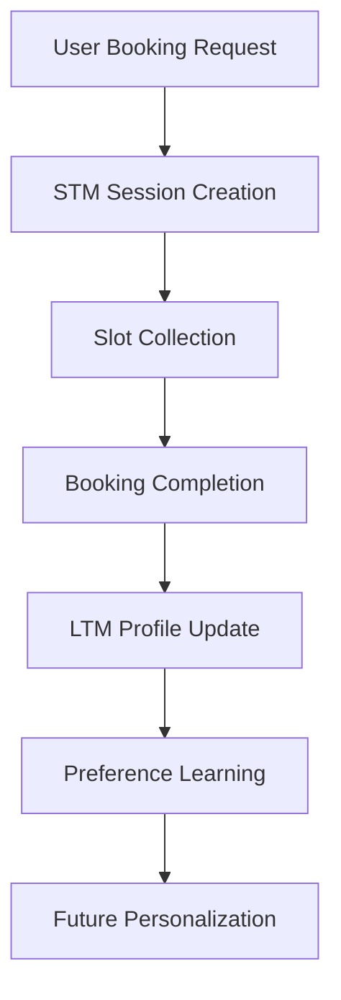

# Memory Directory Management

## Purpose & Responsibilities

The `memory/` directory implements **dual memory systems** for the hospitality booking platform: **Short-Term Memory (STM)** for active session management and **Long-Term Memory (LTM)** for persistent user profiles and preferences. This enables personalized experiences and context preservation across the booking lifecycle.

## Directory Structure

```
memory/
├── __init__.py              # Package initialization
├── short_term.py           # Session state management (STM)
└── long_term.py            # User profiles & preferences (LTM)
```

## Core Components

### Short-Term Memory (STM) - `short_term.py`

**Purpose**: Manages active session state with TTL-based expiration

**Key Features**:
- **Session Lifecycle**: Create, retrieve, update, delete sessions
- **TTL Management**: 30-minute default expiration with auto-cleanup
- **Conversation History**: Message tracking with 50-message limit
- **Slot Management**: Booking parameter collection and validation
- **Memory Monitoring**: Usage statistics and cleanup

**Class: `ShortTermMemory`**

#### Core Methods

```python
async def create_session(session_id: str, user_id: Optional[str] = None)
# Creates new session with initial state structure

async def get_session(session_id: str) -> Optional[Dict[str, Any]]
# Retrieves session, extends TTL on access, auto-cleanup expired

async def update_session(session_id: str, session_data: Dict[str, Any])
# Updates session data, refreshes TTL

async def update_slots(session_id: str, slots: Dict[str, Any])
# Updates booking parameters (city, dates, guests, budget)

async def add_message(session_id: str, role: str, content: str)
# Adds conversation message, maintains 50-message history limit
```

**Session Data Structure**:
```python
{
    "session_id": "unique_id",
    "user_id": "optional_user_id",
    "created_at": "2025-01-01T12:00:00",
    "updated_at": "2025-01-01T12:30:00",
    "expires_at": "2025-01-01T12:30:00",
    "current_agent": "inquiry|availability|booking|...",
    "slots": {
        "city": "Miami",
        "check_in_date": "2025-03-15",
        "check_out_date": "2025-03-18",
        "number_of_guests": 4,
        "budget": 500
    },
    "context": {},
    "messages": [...],
    "booking_data": {}
}
```

### Long-Term Memory (LTM) - `long_term.py`

**Purpose**: Manages persistent user profiles and learning from booking history

**Key Features**:
- **User Profiles**: Persistent user information and preferences
- **Preference Learning**: Automatic preference extraction from bookings
- **Booking History**: Complete booking record tracking
- **Personalization Context**: Rich context for agent personalization
- **Analytics**: User behavior insights and patterns

**Class: `LongTermMemory`**

#### Core Methods

```python
async def get_user_profile(user_id: str) -> Optional[Dict[str, Any]]
# Retrieves complete user profile

async def update_user_profile(user_id: str, profile_data: Dict[str, Any])
# Updates user profile information

async def get_user_preferences(user_id: str) -> Dict[str, Any]
# Gets learned preferences with defaults

async def update_user_preferences(user_id: str, booking_slots: Dict[str, Any])
# Updates preferences based on booking patterns

async def add_booking_to_history(user_id: str, booking_data: Dict[str, Any])
# Adds completed booking to user history

async def get_personalization_context(user_id: str) -> Dict[str, Any]
# Generates rich context for agent personalization
```

**User Profile Structure**:
```python
{
    "user_id": "user_123",
    "created_at": "2025-01-01T00:00:00",
    "preferences": {
        "preferred_cities": ["Miami", "Los Angeles"],
        "preferred_price_range": {"min": 200, "max": 600},
        "preferred_amenities": ["pool", "wifi", "parking"],
        "preferred_property_types": ["villa", "apartment"]
    },
    "booking_history": [...],
    "insights": {
        "booking_count": 5,
        "average_stay_length": 3.2,
        "favorite_destinations": ["Miami"],
        "seasonal_patterns": {...}
    }
}
```

## Memory Integration Flow

### Session-to-Profile Learning Pipeline



### Preference Learning Algorithm

**City Preferences**:
```python
# Tracks frequency and recency of city selections
preferred_cities = Counter(booking_cities).most_common(5)
```

**Price Range Learning**:
```python
# Calculates percentile ranges from booking history
price_range = {
    "min": np.percentile(prices, 25),
    "max": np.percentile(prices, 75)
}
```

**Amenity Preferences**:
```python
# Weights amenities by booking frequency and satisfaction
amenity_scores = calculate_weighted_preferences(bookings, satisfaction_scores)
```

## How to Use & Extend

### Basic Usage

**Session Management**:
```python
from memory.short_term import ShortTermMemory

stm = ShortTermMemory(ttl_minutes=30)

# Create session
session = await stm.create_session("session_123", "user_456")

# Update booking slots
await stm.update_slots("session_123", {
    "city": "Miami",
    "check_in_date": "2025-03-15",
    "number_of_guests": 4
})

# Add conversation message
await stm.add_message("session_123", "user", "I want to book a villa")
```

**User Profile Management**:
```python
from memory.long_term import LongTermMemory

ltm = LongTermMemory()

# Get user preferences
preferences = await ltm.get_user_preferences("user_456")

# Update after booking
await ltm.update_user_preferences("user_456", booking_slots)
await ltm.add_booking_to_history("user_456", booking_data)

# Get personalization context
context = await ltm.get_personalization_context("user_456")
```

### Extending Memory Systems

#### Custom Session Fields

**Add new session fields**:
```python
# In create_session method
session = {
    # ... existing fields
    "custom_field": custom_value,
    "feature_flags": user_feature_flags
}
```

#### Advanced Preference Learning

**Add new learning algorithms**:
```python
async def learn_seasonal_preferences(self, user_id: str):
    """Learn user's seasonal booking patterns."""
    bookings = self._booking_history.get(user_id, [])
    seasonal_data = analyze_booking_seasons(bookings)
    # Update preferences with seasonal insights
```

#### Custom Analytics

**Add user behavior analytics**:
```python
async def get_user_analytics(self, user_id: str) -> Dict[str, Any]:
    """Generate detailed user behavior analytics."""
    return {
        "booking_frequency": calculate_frequency(user_id),
        "price_sensitivity": analyze_price_patterns(user_id),
        "loyalty_score": calculate_loyalty(user_id)
    }
```

## Configuration & Environment

### Memory Settings

**Environment Variables**:
```bash
SESSION_TTL_MINUTES=30          # STM session expiration
STM_MAX_SIZE_MB=100            # STM memory limit
LTM_CLEANUP_INTERVAL=3600      # LTM cleanup frequency (seconds)
```

**Configuration in `config/settings.py`**:
```python
SESSION_TTL_MINUTES = int(os.getenv("SESSION_TTL_MINUTES", "30"))
STM_MAX_SIZE_MB = int(os.getenv("STM_MAX_SIZE_MB", "100"))
```

### Production Considerations

**Redis Integration** (for STM):
```python
import redis

class ShortTermMemory:
    def __init__(self):
        self.redis_client = redis.Redis(
            host=os.getenv('REDIS_HOST', 'localhost'),
            port=int(os.getenv('REDIS_PORT', 6379)),
            decode_responses=True
        )
```

**Firestore Integration** (for LTM):
```python
from google.cloud import firestore

class LongTermMemory:
    def __init__(self):
        self.db = firestore.Client()
        self.users_collection = self.db.collection('users')
```

## Integration with Other Directories

### → `orchestrator/`
- **STM Integration**: Session creation, retrieval, and updates
- **LTM Integration**: User preference loading and profile updates
- **Context Preparation**: Memory data provided to agents

### → `agents/`
- **Personalization**: User preferences influence agent behavior
- **Context Awareness**: Session state guides agent decisions
- **Learning**: Agent interactions update user profiles

### → `mcp_servers/`
- **Data Persistence**: LTM backed by Firestore in production
- **Session Storage**: STM backed by Redis in production
- **Transaction Support**: Atomic updates for consistency

### → `config/`
- **TTL Settings**: Session expiration configuration
- **Memory Limits**: Size and cleanup thresholds
- **Feature Flags**: Memory system feature toggles

## Performance & Monitoring

### Memory Usage Monitoring

```python
# STM monitoring
stm_stats = await stm.get_memory_usage()
print(f"Sessions: {stm_stats['sessions_count']}")
print(f"Memory: {stm_stats['size_mb']}MB / {stm_stats['max_size_mb']}MB")
print(f"Usage: {stm_stats['usage_percentage']}%")
```

### Cleanup & Maintenance

**Automatic Cleanup**:
- **STM**: Expired sessions removed on access
- **LTM**: Periodic cleanup of inactive profiles
- **Memory Limits**: Auto-cleanup when limits exceeded

**Manual Cleanup**:
```python
# Force STM cleanup
await stm._cleanup_expired()

# LTM maintenance
await ltm.cleanup_inactive_profiles(days=365)
```

## Troubleshooting

### Common Issues

1. **Session Not Found**
   ```python
   # Sessions expire after TTL
   session = await stm.get_session(session_id)
   if not session:
       session = await stm.create_session(session_id, user_id)
   ```

2. **Memory Limit Exceeded**
   ```python
   # Monitor and cleanup
   stats = await stm.get_memory_usage()
   if stats['usage_percentage'] > 90:
       await stm._cleanup_expired()
   ```

3. **Profile Data Inconsistency**
   ```python
   # Validate profile structure
   profile = await ltm.get_user_profile(user_id)
   if not profile or 'preferences' not in profile:
       await ltm.initialize_user_profile(user_id)
   ```

### Debug Commands

```python
# Test STM functionality
stm = ShortTermMemory()
session = await stm.create_session("test", "user1")
print("Session created:", session['session_id'])

# Test LTM functionality
ltm = LongTermMemory()
preferences = await ltm.get_user_preferences("user1")
print("User preferences:", preferences)

# Monitor memory usage
stats = await stm.get_memory_usage()
print("Memory stats:", stats)
```

## Testing

### Test Coverage
- **Test Files**: 
  - `tests/test_memory/test_short_term.py` - Session lifecycle, TTL management, message history
  - `tests/test_memory/test_long_term.py` - User profiles, preference learning, booking history
- **Coverage**: Memory operations, data persistence, cleanup mechanisms
- **Test Types**: Unit tests, integration tests, async operation tests

### Running Tests
```bash
# Run all memory tests
pytest tests/test_memory/ -v

# Run specific memory tests
pytest tests/test_memory/test_short_term.py -v

# Run with coverage
pytest tests/test_memory/ --cov=memory --cov-report=html
```

### Test Scenarios Covered
- Session creation, retrieval, and expiration
- TTL management and auto-cleanup
- Message history with limits
- User profile management and updates
- Preference learning from booking data
- Memory usage monitoring and statistics

## Related Tasks

### High Priority
- **Production Deployment** (TASK_PLAN.md #1): Configure Redis/Firestore for production memory
- **Performance Optimization** (TASK_PLAN.md #3): Implement memory caching and optimization
- **Error Handling Enhancement** (TASK_PLAN.md #2): Add resilience for memory operations

### Medium Priority
- **User Experience Enhancement** (TASK_PLAN.md #6): Improve personalization algorithms
- **Analytics and BI** (TASK_PLAN.md #7): Leverage memory data for business insights

### Ongoing
- **Code Quality** (TASK_PLAN.md #10): Optimize memory algorithms and data structures
- **Testing QA** (TASK_PLAN.md #11): Expand memory system test coverage

---

**Next Steps**: See `orchestrator/MANAGE.md` for memory integration details and root `MANAGE.md` for complete system overview.
