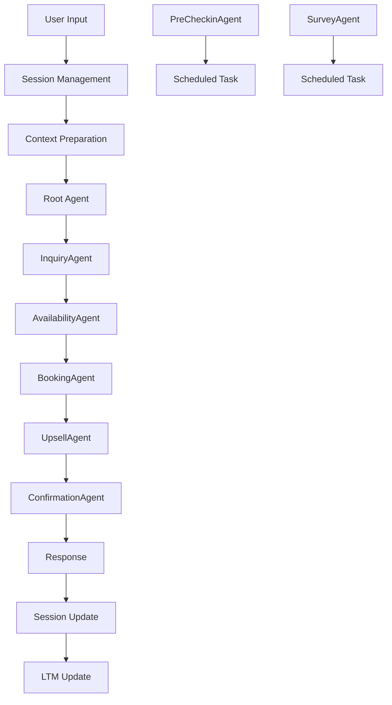

# Orchestrator Directory Management

## Purpose & Responsibilities

The `orchestrator/` directory contains the **main coordination system** that manages the entire hospitality booking flow. It acts as the central hub that orchestrates all 7 specialized agents, maintains session state, handles memory management, and ensures smooth handoffs between agents.

## Directory Structure

```
orchestrator/
├── __init__.py              # Package initialization
└── main.py                  # HospitalityOrchestrator class & entry point
```

## Core Components

### HospitalityOrchestrator Class (`main.py`)

**Primary Responsibilities**:
- **Agent Coordination**: Routes requests through 7 specialized agents sequentially
- **Session Management**: Maintains conversation context and state
- **Memory Integration**: Bridges STM (sessions) and LTM (user profiles)
- **MCP Connection**: Establishes Firestore database connectivity
- **Error Handling**: Graceful failure recovery and user communication
- **Scheduled Tasks**: Background processing for reminders and surveys

### Key Methods

#### `__init__(self)`
**Purpose**: Initialize orchestrator with all components
```python
# Initializes:
- ShortTermMemory (STM) for sessions
- LongTermMemory (LTM) for user profiles  
- Firestore MCP connection
- Root orchestrator agent with all 7 specialized agents
```

#### `handle_request(user_input, session_id, user_id=None)`
**Purpose**: Main request processing pipeline
```python
# Flow:
1. Load/create session from STM
2. Load user preferences from LTM (if user_id provided)
3. Add user input to conversation history
4. Prepare context for agent processing
5. Route through root agent (which delegates to specialized agents)
6. Update session state
7. Save long-term preferences (if booking completed)
8. Return agent response
```

#### `process_scheduled_tasks()`
**Purpose**: Background task processing
```python
# Handles:
- Pre-checkin reminders (48hrs before check-in)
- Post-stay surveys (24hrs after checkout)
- Runs continuously with 1-hour intervals
```

## Agent Orchestration Flow

### Sequential Processing Pipeline



### Context Management

**Session Context Structure**:
```python
{
    "session_id": "unique_session_id",
    "user_id": "optional_user_id",
    "slots": {
        "city": "Miami",
        "check_in_date": "2025-03-15",
        "check_out_date": "2025-03-18",
        "number_of_guests": 4,
        "budget": 500
    },
    "current_agent": "inquiry|availability|booking|...",
    "user_preferences": {...},
    "booking_data": {...},
    "messages": [...]
}
```

## Integration Architecture

### Memory Systems Integration

**Short-Term Memory (STM)**:
- Session creation and retrieval
- Conversation history tracking
- Slot collection and validation
- 30-minute TTL with auto-cleanup

**Long-Term Memory (LTM)**:
- User preference learning
- Booking history tracking
- Personalization context
- Persistent across sessions

### MCP Server Connection

**Firestore MCP Setup**:
```python
firestore_mcp = MCPToolset(
    connection_params=StdioServerParameters(
        command="python",
        args=[str(firestore_server_path)]
    )
)
```

**Available MCP Tools**:
- `create_user()`, `get_user()`
- `create_property()`, `search_properties()`
- `create_booking()`, `get_booking()`, `update_booking_status()`
- `get_user_bookings()`

## How to Use & Extend

### Starting the Orchestrator

**Basic Usage**:
```python
from orchestrator.main import HospitalityOrchestrator

async def main():
    orchestrator = HospitalityOrchestrator()
    
    response = await orchestrator.handle_request(
        user_input="I need a villa in Miami for 4 people next weekend",
        session_id="user_session_123",
        user_id="guest_001"  # Optional
    )
    print(response)
```

**Production Deployment**:
```bash
# Direct execution
python orchestrator/main.py

# Or as module
python -m orchestrator.main
```

### Extending the Orchestrator

#### Adding New Agents

1. **Import New Agent**:
```python
from agents import new_agent

# Add to agents list in __init__
agents=[
    inquiry_agent,
    availability_agent,
    # ... existing agents
    new_agent  # Add here
]
```

2. **Update Orchestration Logic**:
```python
# Modify global_instruction to include new agent in flow
instruction="""Orchestration flow for booking:
...
8. **New Phase** (NewAgent):
   - New agent responsibilities
   - Transfer conditions
"""
```

#### Customizing Agent Flow

**Conditional Agent Execution**:
```python
# In global_instruction, add conditions
if session.get('feature_flags', {}).get('enable_new_feature'):
    # Execute new agent
    pass
```

**Parallel Agent Execution** (for independent tasks):
```python
# Modify handle_request to support parallel execution
import asyncio

async def parallel_processing():
    tasks = [
        agent1.run(context),
        agent2.run(context)
    ]
    results = await asyncio.gather(*tasks)
    return combine_results(results)
```

### Configuration & Environment

**Required Environment Variables**:
```bash
FIRESTORE_PROJECT_ID=your-project-id
GOOGLE_APPLICATION_CREDENTIALS=/path/to/service-account.json
ADK_MODEL=gemini-2.0-flash
SESSION_TTL_MINUTES=30
```

**Feature Flags Integration**:
```python
from config.settings import ENABLE_UPSELL, ENABLE_SURVEY

# Conditional agent execution based on flags
if ENABLE_UPSELL:
    agents.append(upsell_agent)
```

## Error Handling & Recovery

### Graceful Failure Patterns

**Agent Failure Recovery**:
```python
try:
    response = await self.root_agent.run(messages, context)
except Exception as e:
    logger.error(f"Agent execution failed: {e}")
    return "I apologize, but I encountered an error. Please try again."
```

**MCP Connection Failure**:
```python
if not self.firestore_mcp:
    # Fallback to mock data or alternative storage
    logger.warning("Firestore MCP unavailable, using fallback")
```

**Session Recovery**:
```python
# Auto-create session if not found
session = await self.stm.get_session(session_id)
if not session:
    session = await self.stm.create_session(session_id, user_id)
```

## Performance Optimization

### Memory Management
- **Session Cleanup**: Automatic TTL-based cleanup
- **Connection Pooling**: Reuse MCP connections
- **Context Limiting**: Truncate conversation history (50 messages max)

### Latency Optimization
- **Async Processing**: All I/O operations are async
- **Context Caching**: Cache user preferences
- **Agent Preloading**: Initialize agents once at startup

### Monitoring & Metrics
```python
# Add performance tracking
import time

start_time = time.time()
response = await self.root_agent.run(...)
processing_time = time.time() - start_time

logger.info(f"Request processed in {processing_time:.2f}s")
```

## Integration with Other Directories

### → `agents/`
- Imports all 7 specialized agents
- Provides agents with MCP tools and context
- Manages agent execution sequence

### → `memory/`
- Direct integration with STM and LTM classes
- Session lifecycle management
- User preference persistence

### → `mcp_servers/`
- Establishes connection to Firestore MCP server
- Provides database tools to agents
- Handles transaction support

### → `config/`
- Loads environment settings
- Applies feature flags to agent execution
- Business rule enforcement

## Troubleshooting

### Common Issues

1. **MCP Connection Failures**
   ```bash
   # Check MCP server path
   python mcp_servers/firestore/server.py
   
   # Verify credentials
   echo $GOOGLE_APPLICATION_CREDENTIALS
   ```

2. **Agent Import Errors**
   ```python
   # Test agent imports
   from agents import inquiry_agent
   print(inquiry_agent.name)
   ```

3. **Session Management Issues**
   ```python
   # Check STM functionality
   from memory.short_term import ShortTermMemory
   stm = ShortTermMemory()
   session = await stm.create_session("test", "user1")
   ```

### Debug Mode

```python
# Enable debug logging
import logging
logging.basicConfig(level=logging.DEBUG)

# Test orchestrator initialization
orchestrator = HospitalityOrchestrator()
print("Agents loaded:", len(orchestrator.root_agent.agents))
print("MCP connected:", orchestrator.firestore_mcp is not None)
```

### Performance Monitoring

```python
# Monitor session count and memory usage
stm_stats = await orchestrator.stm.get_memory_usage()
print(f"Active sessions: {stm_stats['sessions_count']}")
print(f"Memory usage: {stm_stats['size_mb']}MB")
```

## Testing

### Test Coverage
- **Test File**: `tests/test_orchestrator/test_main.py`
- **Coverage**: Core orchestrator functionality, session management, error handling
- **Test Types**: Unit tests, integration tests, async operation tests

### Running Tests
```bash
# Run orchestrator tests
pytest tests/test_orchestrator/ -v

# Run with coverage
pytest tests/test_orchestrator/ --cov=orchestrator --cov-report=html
```

### Test Scenarios Covered
- Session creation and management
- Agent orchestration flow
- Memory integration (STM/LTM)
- Error handling and recovery
- MCP connection handling
- User preference updates

## Related Tasks

### High Priority
- **Production Deployment** (TASK_PLAN.md #1): Configure production environment
- **Error Handling Enhancement** (TASK_PLAN.md #2): Improve resilience patterns
- **Performance Optimization** (TASK_PLAN.md #3): Add caching and query optimization

### Medium Priority
- **Advanced Booking Features** (TASK_PLAN.md #4): Extend orchestration for complex workflows
- **User Experience Enhancement** (TASK_PLAN.md #6): Add real-time communication features

### Ongoing
- **Code Quality** (TASK_PLAN.md #10): Regular refactoring and maintenance
- **Testing QA** (TASK_PLAN.md #11): Expand test coverage and scenarios

---

**Next Steps**: See root `MANAGE.md` for complete system overview and `agents/MANAGE.md` for agent-specific details.
